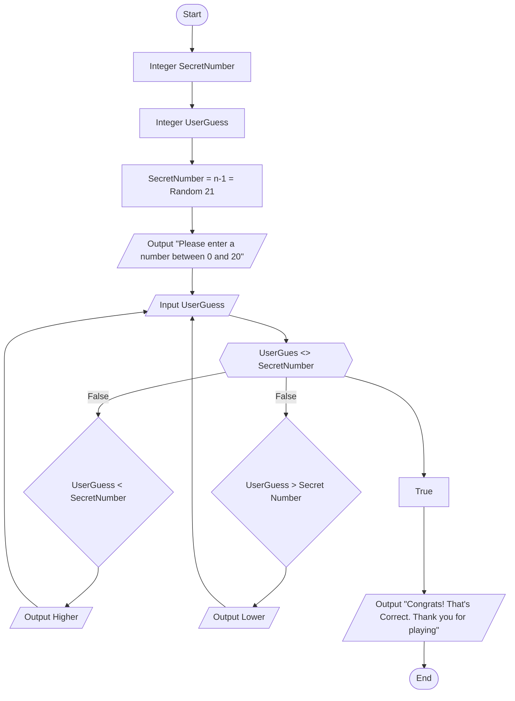

## How it works
The game works by having the computer randomly select a number in the given field. The formula is n-1, meaning whatever number we input, the guessing range will be maximum one less. In this case we chose 21, so our range is 0-20. Once the computer has picked its number, it prompts the user to input a number between 0 and 20. If the number is incorrect, it will output the phrase Higher or Lower deoending on the value. Once they user has guessed correctly, the game will then output Congrats! That's Correct. Thank you for playing, informing you that you have won.
